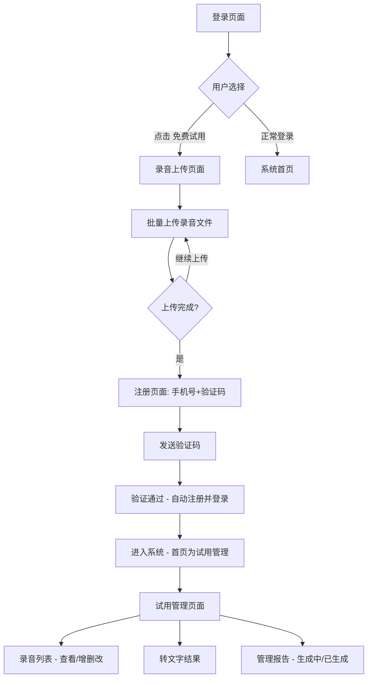

# 销售保AI - 试用入口功能方案

## 一、需求概述

在现有登录页面增加"免费试用"入口，让潜在客户无需注册即可先上传录音文件体验产品核心能力，上传完成后再引导注册，降低用户使用门槛，提升转化率。

## 二、用户旅程流程

## 三、页面清单与设计要点

### 页面1：登录页面（改造）

- **改动点**：在"下载销售保APP | 立即注册"下方或登录按钮下方，增加醒目的"免费试用"入口
- **入口样式**：渐变色按钮或带图标的引导卡片，文案如"免费试用 - 上传录音，体验AI质检"
- **视觉优先级**：低于登录按钮，但足够醒目

### 页面2：录音上传页面

- **页面风格**：简洁大方，延续品牌视觉风格
- **核心区域**：
  - 顶部标题："上传您的销售录音，体验AI分析"
  - 步骤条：① 上传录音 → ② 注册账号 → ③ 查看结果
  - 拖拽上传区域（支持点击选择 + 拖拽）
  - 支持格式提示：MP3、WAV、M4A、AMR等常见格式
  - 已上传文件列表（文件名、大小、状态、删除按钮）
  - 底部按钮："上传完成，下一步"
- **交互细节**：
  - 文件上传进度条
  - 上传成功/失败状态标识
  - 不限录音数量（建议提示单文件大小限制如200MB）

### 页面3：手机号注册页面

- **页面布局**：居中卡片式
- **友好提示**：顶部提示"输入手机号后，我们将为您生成专属管理报告，并及时与您联系"
- **表单字段**：
  - 手机号输入框
  - 图形验证码（可选，防刷）
  - 短信验证码 + 获取验证码按钮（60秒倒计时）
  - 同意服务协议勾选
  - "完成注册，查看结果"按钮
- **交互细节**：
  - 输入手机号后高亮提示："输入手机号后，我们才能联系您，为您生成管理报告哦~"
  - 注册成功后自动登录跳转

### 页面4：试用管理页面 - 录音列表

- **页面位置**：登录后左侧菜单"试用管理"（作为首页默认展示）
- **页面结构**：
  - Tab切换：录音管理 | 分析报告
  - 操作区：上传录音按钮、批量删除
  - 录音列表表格：
    - 序号
    - 文件名
    - 时长
    - 上传时间
    - 转写状态（转写中/已完成）
    - 操作（查看转文字、编辑、删除）
  - 点击"查看转文字"展开/弹窗显示转写文本

### 页面5：试用管理页面 - 分析报告

- **Tab切换到报告视图**
- **报告未生成状态**：
  - 友好插画 + 文案："报告生成中，预计上传录音后2个工作日内完成"
  - 进度提示条/状态标签
  - "我们会在报告生成后通知您"
- **报告已生成状态**：
  - 报告卡片列表
  - 报告类型、生成时间、查看按钮
  - 点击进入报告详情页

## 四、关键交互状态

| 状态场景 | 展示方式 |
|---------|---------|
| 文件上传中 | 进度条 + 百分比 |
| 文件上传成功 | 绿色勾 + 文件信息 |
| 文件上传失败 | 红色叉 + 重新上传 |
| 验证码发送中 | 按钮loading |
| 验证码倒计时 | 60s倒计时灰色按钮 |
| 转写进行中 | 蓝色标签"转写中" |
| 转写已完成 | 绿色标签"已完成" |
| 报告生成中 | 插画+进度提示 |
| 报告已生成 | 报告卡片可点击查看 |

## 五、正式用户处理

- 正式用户（已付费）登录后**不显示**"试用管理"菜单
- 菜单可见性通过用户角色/标签控制

## 六、演示原型说明

使用纯HTML/CSS/JS制作可点击的交互原型，包含以下可演示的完整流程：

1. 登录页 → 点击"免费试用"
2. 进入录音上传页 → 模拟上传文件
3. 点击"下一步" → 进入手机号注册页
4. 填写信息 → 点击注册
5. 自动跳转到系统后台 → 试用管理页面
6. 查看录音列表和转文字结果
7. 切换到报告Tab → 查看报告生成状态
